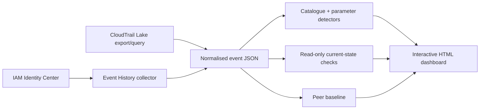

# 🛡️ AWS Offboarding Audit

**Cross-account CloudTrail collection, backdoor detection, and a local investigation dashboard for cloud engineer offboarding.**


---

## 📋 Table of Contents

- [Overview](#-overview)
- [Features](#-features)
- [Architecture](#-architecture)
- [Quick Start](#-quick-start)
- [Current-State Checks](#-current-state-checks)
- [Peer Baseline](#-peer-baseline)
- [CloudTrail Lake](#-cloudtrail-lake)
- [External Analysis](#-external-analysis)
- [Security](#-security)
- [Testing](#-testing)
- [Limits](#-limits)

---

## 🎯 Overview

AWS Offboarding Audit reviews a departing engineer's activity across every AWS account available
through IAM Identity Center. It collects CloudTrail events, checks request parameters for durable
access and destructive changes, and builds a portable HTML dashboard for the security or IT team.

The report separates three different facts:

| Signal | Meaning |
| --- | --- |
| **Intrinsic severity** | What the API action can do |
| **Timing severity** | Whether it happened during notice or after the last working day |
| **Current state** | Whether the affected resource or access still exists |

Severity is a review priority, not a statement of intent. Confirm every item against change tickets
and planned work before taking action.

## ✨ Features

- 🔎 **Exact identity matching** across SSO usernames, session ARNs, principal IDs, IAM usernames,
  and Identity Center session issuers
- 🌍 **Cross-account collection** with per-account and per-region coverage, failures, denials, and
  resumable checkpoints
- 🧩 **Parameter inspection** for external trust, wildcard policies, public resources, long-lived
  credentials, open security groups, destructive lifecycle rules, and logging changes
- 🔗 **Bounded sequence correlation** requiring ordered activity from the same principal and target
- 📊 **Interactive dashboard** with search plus severity, account, category, date, and current-state
  filters
- ✅ **Read-only reconciliation** for IAM users and roles, Lambda URLs, snapshots, buckets, security
  groups, KMS keys, databases, and CloudTrail trails
- 📈 **Peer baselines** built from comparable historical or colleague audit files
- 🗄️ **CloudTrail Lake support** for management and data events when the event data store records
  them
- 🔐 **Secret-safe workflow** with ignored evidence files, pre-commit and pre-push Gitleaks checks,
  and optional `age` encryption for archives

## 🏗 Architecture



Collection and reporting remain separate. You can rebuild the dashboard from saved event JSON
without querying AWS again.

## ⚡ Quick Start

### Install

```bash
python3 -m venv .venv
.venv/bin/python -m pip install -r requirements.txt
cp audit-config.example.yaml audit-config.yaml
```

`audit-config.yaml` is ignored by Git. Store organization account IDs and SSO settings there.

### Check The Scope

```bash
aws sso login --sso-session company

.venv/bin/python aws_offboarding_dashboard.py \
  --config audit-config.yaml \
  --preflight
```

Preflight discovers accounts and writes the collection plan without querying CloudTrail.

### Collect And Build The Dashboard

```bash
.venv/bin/python aws_offboarding_dashboard.py \
  --config audit-config.yaml \
  --notice-date 2026-07-24 \
  --last-day 2026-08-15 \
  --org-accounts 111122223333 444455556666 \
  --out aws_offboarding_report \
  --open
```

Add `--resume` after an interrupted collection. The dashboard is a self-contained local HTML file
and does not need a web server.

## ✅ Current-State Checks

CloudTrail records a historical change. It cannot prove that the change still exists. Run the
read-only reconciler after collection:

```bash
.venv/bin/python aws_current_state.py aws_offboarding_audit.json \
  --sso-session company \
  --out aws_offboarding.state.json

.venv/bin/python aws_offboarding_dashboard.py \
  --input aws_offboarding_audit.json \
  --state aws_offboarding.state.json \
  --out aws_offboarding_report
```

An access-denied state check remains `unknown`. The tool never treats a denied check as proof that
the resource was removed.

## 📈 Peer Baseline

Use at least three comparable peer or historical collections:

```bash
.venv/bin/python audit_baseline.py peer-a.json peer-b.json peer-c.json \
  --label "Platform engineering peers" \
  --out platform.baseline.json
```

Pass the result with `--baseline platform.baseline.json`. Baseline deviation stays separate from
security severity.

## 🗄 CloudTrail Lake

Review the SQL before executing a Lake query:

```bash
.venv/bin/python aws_cloudtrail_lake.py \
  --event-data-store 12345678-1234-1234-1234-123456789012 \
  --user leaver@example.com \
  --start 2026-08-01T00:00:00Z \
  --end 2026-08-24T00:00:00Z \
  --dry-run
```

Remove `--dry-run` to execute with the active AWS credentials. Existing Lake or Athena JSON/CSV
exports can be normalized with `--input <file>`.

## 🔬 External Analysis

The optional `--analyze` pass sends a bounded findings digest to the Anthropic Messages API. Raw
CloudTrail logs are not sent. Keep the API key in the process environment:

```bash
export ANTHROPIC_API_KEY="..."

.venv/bin/python aws_offboarding_dashboard.py \
  --input aws_offboarding_audit.json \
  --analyze \
  --redact
```

`--redact` hashes account IDs and IP addresses before the digest leaves the machine. The returned
JSON is schema-validated and remains advisory.

## 🔒 Security

Audit files can contain account IDs, ARNs, usernames, source IPs, resource names, and request
parameters. The repository ignores collector output, manifests, state files, baselines, archives,
credentials, local configuration, and private keys.

Local Git hooks run both the repository scanner and Gitleaks before commits and pushes. Use `age`
when packaging evidence:

```bash
.venv/bin/python aws_offboarding_audit.py \
  --config audit-config.yaml \
  --archive \
  --encrypt-recipient age1example
```

See [SECURITY.md](SECURITY.md) for handling and rotation guidance.

## 🧪 Testing

```bash
.venv/bin/python scripts/secret_scan.py
.venv/bin/python -m unittest discover -s tests -v
```

The security workflow can also be run manually from the GitHub Actions tab when hosted runners are
available.

## ⚠ Limits

- Event History covers the most recent 90 days and management events only.
- Data-event coverage depends on CloudTrail Lake or Athena selectors and retention.
- `--loose` identity matching includes events that mention the subject and can produce false
  positives.
- Collection denials and logging changes create visible coverage gaps.
- Current-state reconciliation is best effort; unsupported or denied checks remain `unknown`.

Detector internals, data contracts, and extension notes are in [HANDOFF.md](HANDOFF.md).
