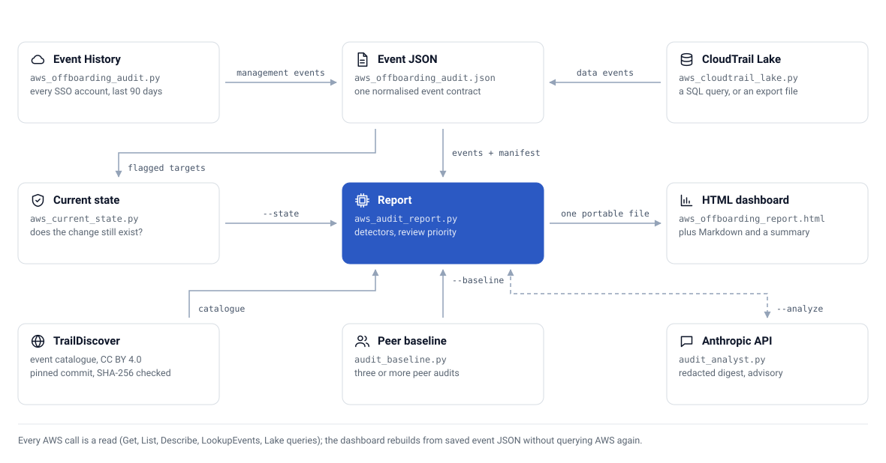

<div align="center">

# 🛡️ AWS Offboarding Audit

**Cross-account CloudTrail collection, backdoor detection, and a local investigation dashboard for cloud engineer offboarding**


[](LICENSE)
[](https://github.com/CaputoDavide93/AWS-OffBoarding-Audit/actions/workflows/security.yml)

[Overview](#-overview) • [Features](#-features) • [Architecture](#️-architecture) • [Quick Start](#-quick-start) • [Usage](#-usage) • [Testing](#-testing) • [Documentation](#-documentation)

</div>

---

## 🎯 Overview

AWS Offboarding Audit reviews a departing engineer's activity across every AWS account available
through IAM Identity Center. It collects CloudTrail events, checks request parameters for durable
access and destructive changes, and builds a portable HTML dashboard for the security or IT team.

A fully synthetic example is in [docs/assets/example-report.html](docs/assets/example-report.html). Download it
and open it locally to see the dashboard before running anything; no account IDs in it are real.

The report separates three different facts:

| Signal | Meaning |
| --- | --- |
| **Intrinsic severity** | What the API action can do |
| **Timing severity** | Whether it happened during notice or after the last working day |
| **Current state** | Whether the affected resource or access still exists |

Severity is a review priority, not a statement of intent. Confirm every item against change tickets
and planned work before taking action.

The report opens in plain-English mode: a short explainer for HR or an IT lead, framed by whether
the person is still employed, on notice, or already departed. A switch at the top reveals the
underlying API names, timestamps, regions, and raw request parameters for whoever needs them.

---

## 👁️ Read-only, by design

Every AWS call this project makes reads state; none changes it. The complete list:

| Service | Calls |
|---|---|
| IAM Identity Center | `ListAccounts`, `ListAccountRoles`, `GetRoleCredentials` (short-lived sign-in to each account) |
| CloudTrail | `LookupEvents`, `GetTrailStatus` |
| CloudTrail Lake | `StartQuery`, `GetQueryResults` (runs a SQL query over the event data store; it stores nothing) |
| IAM | `GetUser`, `GetRole`, `ListAccessKeys` |
| EC2 | `DescribeRegions`, `DescribeSecurityGroups`, `DescribeSnapshots`, `DescribeSnapshotAttribute` |
| RDS | `DescribeDBInstances`, `DescribeDBClusters` |
| KMS | `DescribeKey` |
| Lambda | `GetFunction`, `GetFunctionUrlConfig` |
| S3 | `HeadBucket`, `GetBucketReplication`, `GetBucketLifecycleConfiguration` |

There is no `Create*`, `Put*`, `Delete*`, `Update*`, `Terminate*`, `Modify*`, `Attach*`/`Detach*`, or
`Revoke*` call anywhere in this codebase. Running it cannot alter, disable, or delete anything in your
AWS accounts.

Three things reach beyond AWS:

- **TrailDiscover catalogue** — `aws_audit_report.py` downloads it from GitHub
  (`raw.githubusercontent.com`) at a pinned commit, verifies it by SHA-256, and caches it for seven
  days. `--no-enrich` skips it.
- **Anthropic API** — only with `--analyze` (the [external analysis](#-external-analysis) pass). It
  sends a bounded findings digest, never raw logs, with account IDs and IP addresses hashed by default.
- **Google Fonts** — the HTML dashboard links IBM Plex from `fonts.googleapis.com`, so the browser
  that opens the report fetches it. The script itself makes no such call.

---

## ✨ Features

| | Feature | What it does |
|---|---|---|
| 🔎 | Exact identity matching | Matches across SSO usernames, session ARNs, principal IDs, IAM usernames, and Identity Center session issuers |
| 🌍 | Cross-account collection | Per-account and per-region coverage, failures, denials, and resumable checkpoints |
| 🧩 | Parameter inspection | Checks request parameters for external trust, wildcard policies, public resources, long-lived credentials, open security groups, destructive lifecycle rules, and logging changes |
| 🔗 | Bounded sequence correlation | Links ordered activity from the same principal, account, target, and time window, with optional two-hypothesis AI interpretation |
| 📊 | Paged interactive dashboard | A 1-10 evidence review priority plus search and severity, account, category, date, and current-state filters |
| 🧭 | Plain-language assessments | Separates likely routine activity, items to watch, and evidence that needs prompt investigation without claiming to infer intent |
| 👔 | HR-facing by default | A non-technical explainer opens first, framed by employment status (employed, on notice, or departed), with a switch to reveal full technical detail on demand |
| 📋 | Evidence-aware readiness checklist | Separates report-backed checks from manual identity, credential, session, secret-rotation, and handover controls |
| ✅ | Read-only reconciliation | Checks IAM users and roles, Lambda URLs, snapshots, buckets, security groups, KMS keys, databases, and CloudTrail trails |
| 📈 | Peer baselines | Built from comparable historical or colleague audit files |
| 🗄️ | CloudTrail Lake support | Queries management and data events when the event data store records them |
| 🕵️ | Privacy by default | Identifiers are redacted before any analyst call (`--no-redact` to opt out) and analyst web search is opt-in (`--search`) |
| 📌 | Pinned threat intel | The TrailDiscover dataset is pinned to a reviewed commit and hash-verified, so upstream changes never silently alter report wording |
| 🔐 | Secret-safe workflow | Ignored evidence files, pre-commit and pre-push Gitleaks checks, and optional `age` encryption for archives |

---

## 🗺️ Architecture

<picture>
  <source media="(prefers-color-scheme: dark)" srcset="docs/assets/architecture-dark.svg">
  
</picture>

Collection and reporting remain separate. You can rebuild the dashboard from saved event JSON
without querying AWS again. Current state, the peer baseline and the external analysis are optional
inputs to the report, passed with `--state`, `--baseline` and `--analyze`.

---

## 🚀 Quick Start

### Install

```bash
python3 -m venv .venv
.venv/bin/python -m pip install -r requirements.txt
cp audit-config.example.yaml audit-config.yaml
```

`audit-config.yaml` is ignored by Git. Store organization account IDs, SSO settings, timezone, and
working hours there. The `collector:` block controls collection; the `report:` block controls report
defaults. Command-line values override both.

### Check the scope

```bash
aws sso login --sso-session company

.venv/bin/python src/aws_offboarding_dashboard.py \
  --config audit-config.yaml \
  --preflight
```

Preflight discovers accounts and writes the collection plan without querying CloudTrail.

### Collect and build the dashboard

```bash
.venv/bin/python src/aws_offboarding_dashboard.py \
  --config audit-config.yaml \
  --notice-date 2026-07-24 \
  --last-day 2026-08-15 \
  --out aws_offboarding_report \
  --open
```

Add `--resume` after an interrupted collection. The dashboard is a self-contained local HTML file
and does not need a web server.

Every command in this README writes to the current directory by default. Point `--out` and
`--raw-out` at `working/` instead (e.g. `--out working/aws_offboarding_report`) to keep generated
evidence out of the repo root; that path is already gitignored.

---

## 📖 Usage

### ✅ Current-State Checks

CloudTrail records a historical change. It cannot prove that the change still exists. Run the
read-only reconciler after collection:

```bash
.venv/bin/python src/aws_current_state.py aws_offboarding_audit.json \
  --sso-session company \
  --out aws_offboarding.state.json

.venv/bin/python src/aws_offboarding_dashboard.py \
  --input aws_offboarding_audit.json \
  --state aws_offboarding.state.json \
  --out aws_offboarding_report
```

An access-denied state check remains `unknown`. The tool never treats a denied check as proof that
the resource was removed.

### 📈 Peer Baseline

Use at least three comparable peer or historical collections:

```bash
.venv/bin/python src/audit_baseline.py peer-a.json peer-b.json peer-c.json \
  --label "Platform engineering peers" \
  --out platform.baseline.json
```

Pass the result with `--baseline platform.baseline.json`. Baseline deviation stays separate from
security severity.

### 🗄️ CloudTrail Lake

Review the SQL before executing a Lake query:

```bash
.venv/bin/python src/aws_cloudtrail_lake.py \
  --event-data-store 12345678-1234-1234-1234-123456789012 \
  --user leaver@example.com \
  --start 2026-08-01T00:00:00Z \
  --end 2026-08-24T00:00:00Z \
  --dry-run
```

Remove `--dry-run` to execute with the active AWS credentials. `start_query`/`get_query_results` is
a read query against your event data store, still read-only, no write API involved. Existing Lake
or Athena JSON/CSV exports can be normalized with `--input <file>`.

### 🔬 External Analysis

The optional `--analyze` pass sends a bounded findings digest to the Anthropic Messages API. Raw
CloudTrail logs are not sent. Keep the API key in the process environment:

```bash
export ANTHROPIC_API_KEY="..."

.venv/bin/python src/aws_offboarding_dashboard.py \
  --input aws_offboarding_audit.json \
  --analyze
```

Account IDs and IP addresses are hashed before the digest leaves the machine (pass `--no-redact` to
send them in clear), and web search is off unless you add `--search`. The returned
JSON is schema-validated and remains advisory. For each detected activity pattern, the analyst
compares a plausible routine explanation with a concerning hypothesis and names the evidence that
would distinguish them. It does not claim to know the person's purpose or intent.

The `Current review priority` score does not require the API. It is calculated locally from timing,
request-parameter findings, same-principal/same-target patterns, current state, failed attempts,
baseline deviation, collection coverage, and identity-match quality. The number ranks evidence for
review; it is not a probability of wrongdoing or a score of the person.

### 📋 Offboarding Playbook

CloudTrail review is only one control in offboarding. Access must also be disabled in the
authoritative identity provider, active sessions addressed, standalone IAM credentials removed,
shared secrets rotated, and resources and operational duties transferred to a current owner.

Use the [AWS offboarding playbook](docs/offboarding-playbook.md) for the phased checklist, ownership
model, closure criteria, evidence boundaries, and links to the AWS guidance behind those controls.
The generated HTML and Markdown reports include a shorter readiness checklist for each run.

---

## 🔒 Security

Audit files can contain account IDs, ARNs, usernames, source IPs, resource names, and request
parameters. The repository ignores collector output, manifests, state files, baselines, archives,
credentials, local configuration, and private keys.

Local Git hooks run both the repository scanner and Gitleaks before commits and pushes. Use `age`
when packaging evidence:

```bash
.venv/bin/python src/aws_offboarding_audit.py \
  --config audit-config.yaml \
  --archive \
  --encrypt-recipient age1example
```

See [SECURITY.md](SECURITY.md) for handling and rotation guidance.

---

## 🧪 Testing

```bash
.venv/bin/python tools/secret_scan.py
ruff check .
.venv/bin/python -m unittest discover -s tests -v
```

The architecture diagram is drawn by `tools/gen_diagram.py` (standard library only). Re-run it after
editing a diagram; `tests/test_diagrams.py` fails if the committed SVGs differ from what it draws.

CI runs the secret scan, `ruff`, and this same suite plus Gitleaks on every push and pull request to `main`, and can also be
triggered manually from the GitHub Actions tab.

---

## ⚠️ Limits

- Event History covers the most recent 90 days and management events only.
- Data-event coverage depends on CloudTrail Lake or Athena selectors and retention.
- `--loose` identity matching includes events that mention the subject and can produce false
  positives.
- Collection denials and logging changes create visible coverage gaps.
- Current-state reconciliation is best effort; unsupported or denied checks remain `unknown`.

---

## 📁 Repo structure

```text
AWS-OffBoarding-Audit/
├── src/                        # 🧠 collector, report builder, dashboard, current-state, Lake, baseline, AI pass
├── tests/                      # 🧪 unittest suite
│   └── fixtures/gen_sample.py  # 🎲 writes a synthetic sample.json for demos and tests
├── tools/                      # 🔧 secret_scan.py (repo scanner) + gen_diagram.py (SVG diagrams)
├── docs/                       # 📚 tutorial, how-to, reference, explanation, playbook
│   └── assets/                 # 🖼️ architecture SVGs + synthetic example report
├── .githooks/                  # 🪝 pre-commit / pre-push secret scan + tests
├── .github/workflows/          # 🤖 CI: secret scan, ruff, tests, Gitleaks
├── audit-config.example.yaml   # ⚙️ copy to audit-config.yaml
└── requirements.txt
```

---

## 📚 Documentation

| Doc | Type | For |
| --- | --- | --- |
| [docs/tutorial-getting-started.md](docs/tutorial-getting-started.md) | Tutorial | First run, synthetic then real |
| [docs/offboarding-playbook.md](docs/offboarding-playbook.md) | Playbook | Access removal, evidence review, ownership, and closure criteria |
| [docs/howto-guide.md](docs/howto-guide.md) | How-to | Specific tasks: SSO setup, baselines, Lake, AI analysis, archiving |
| [docs/reference-cli.md](docs/reference-cli.md) | Reference | Every flag, across all six scripts |
| [docs/reference-data-contract.md](docs/reference-data-contract.md) | Reference | The event JSON schema, collector → report |
| [docs/explanation-architecture.md](docs/explanation-architecture.md) | Explanation | Pipeline design, severity model, detector internals, extension points |

The full index is in [docs/README.md](docs/README.md).

---

## 📄 License

Licensed under [MIT](LICENSE).

---

<p align="center">
  <sub>⭐ If this project helped you, please give it a star! ⭐</sub>
  <br>
  <sub>Made with ❤️ by <a href="https://github.com/CaputoDavide93">Davide Caputo</a></sub>
</p>
